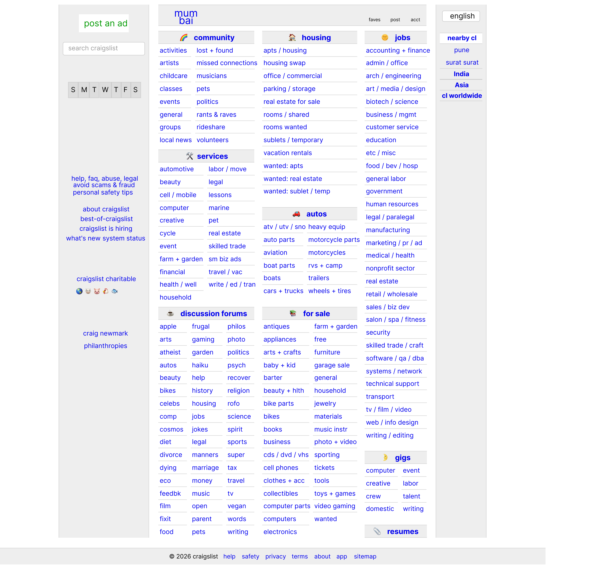
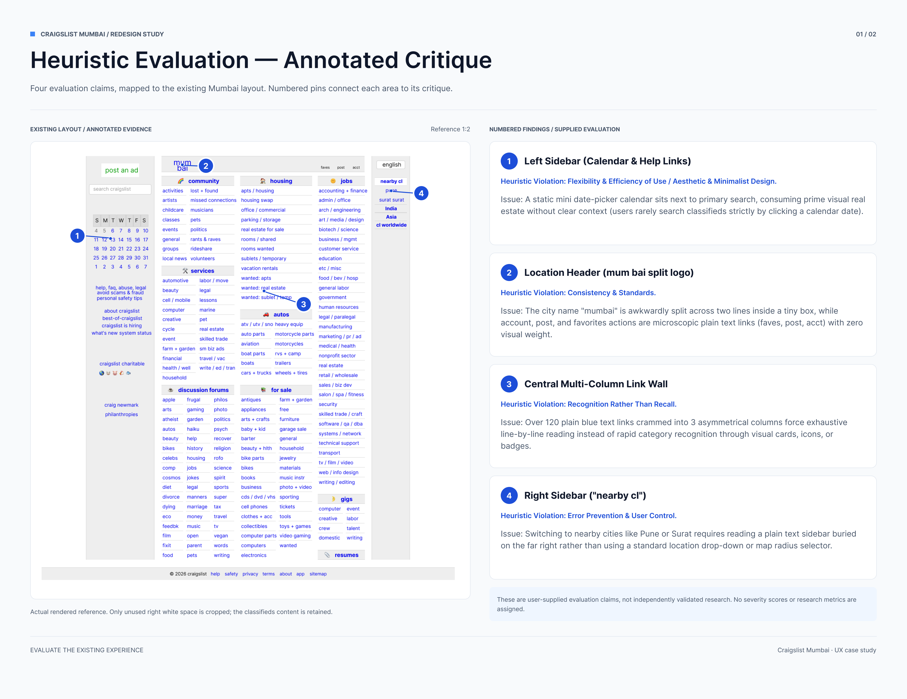
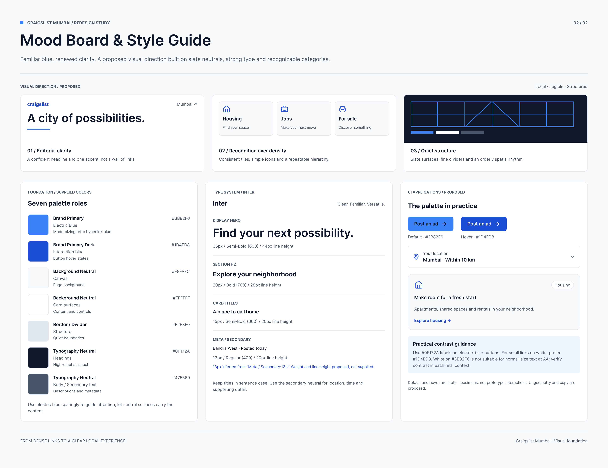
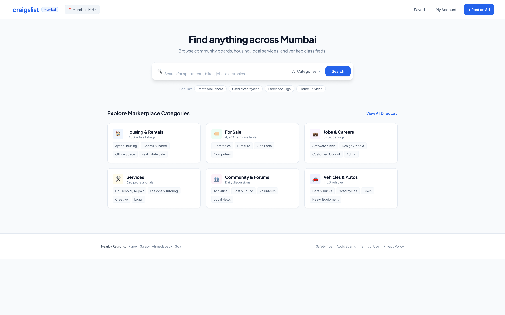
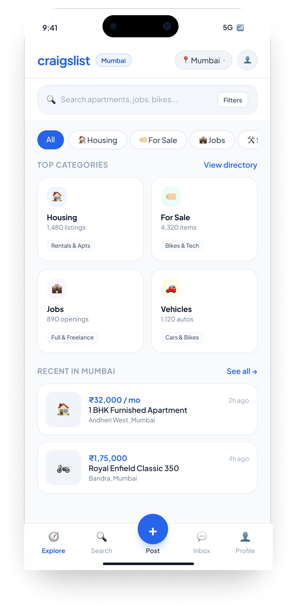

# 🎨 Craigslist Mumbai — Website UI Redesign

A comprehensive UI/UX overhaul of the Craigslist Mumbai homepage focused on usability heuristics, modern design patterns, and responsive layouts across Desktop and Mobile viewports.

---

## 🔗 Live Figma Project
👉 **[Open Interactive Figma File](https://www.figma.com/design/TgM6OKU3IbRZBNIg8523uD/Website-Ui-Redesign?t=GfcOmtFdOy0xVxt5-1)** *(View permissions enabled)*

---

## 📌 Project Overview
* **Target Website:** Craigslist Mumbai (`mumbai.craigslist.org`)
* **Objective:** Redesign an outdated, text-heavy classifieds interface into an intuitive, accessible, and responsive modern marketplace.
* **Tools & Techniques:** Figma, Auto Layout, Style Guides, Component Variants, Heuristic Evaluation.

---

## 🚀 Process & Deliverables

### 1. Original Website Audit
Baseline review of the current Craigslist Mumbai platform identifying high link density, lack of visual hierarchy, and interaction friction.

---

### 2. Heuristic Evaluation (Jakob Nielsen)
* **Recognition Rather Than Recall:** Restructured 100+ dense, unstyled blue text links into structured visual cards with clear iconography.
* **Consistency & Standards:** Standardized action hierarchies including search bars, location selectors, and primary CTA buttons.
* **Flexibility & Efficiency of Use:** Replaced static directory links with an inline location switcher (`Mumbai + Radius`).
* **Aesthetic & Minimalist Design:** Removed non-essential sidebar elements (such as the non-functional date-picker calendar) to reduce cognitive load.

---

### 3. Mood Board & Style Guide
* **Color Palette:** Primary Electric Blue (`#2563EB`) accent, clean surface neutrals (`#FFFFFF`, `#F8FAFC`), and accessible slate typography tones (`#0F172A`).
* **Typography:** `Plus Jakarta Sans` responsive type scale.
* **UI Components:** Reusable Auto Layout search inputs, tag pills, listing cards, and button variants.

---

### 4. High-Fidelity Desktop Redesign (1440px)
* 12-column responsive layout grid.
* Unified hero search container with quick-filter pills.
* Structured 6-category marketplace card section with listing count metrics.
* Localized "Recent in Mumbai" card feed with price and location badges.

---

### 5. High-Fidelity Mobile Redesign (Responsive)
* Touch-first mobile layout with standard 44px minimum tap targets.
* 2-column category grid and a horizontal swipeable filter carousel.
* Sticky search and fixed bottom navigation featuring an elevated `+ Post` action.

